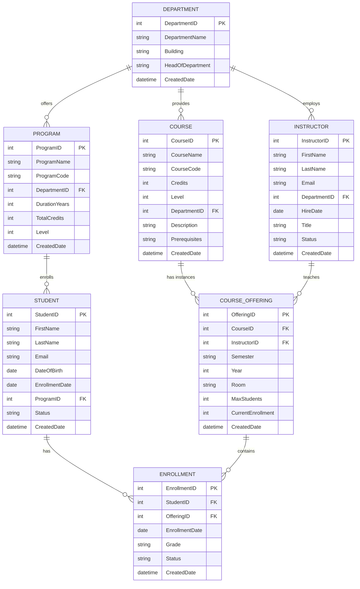
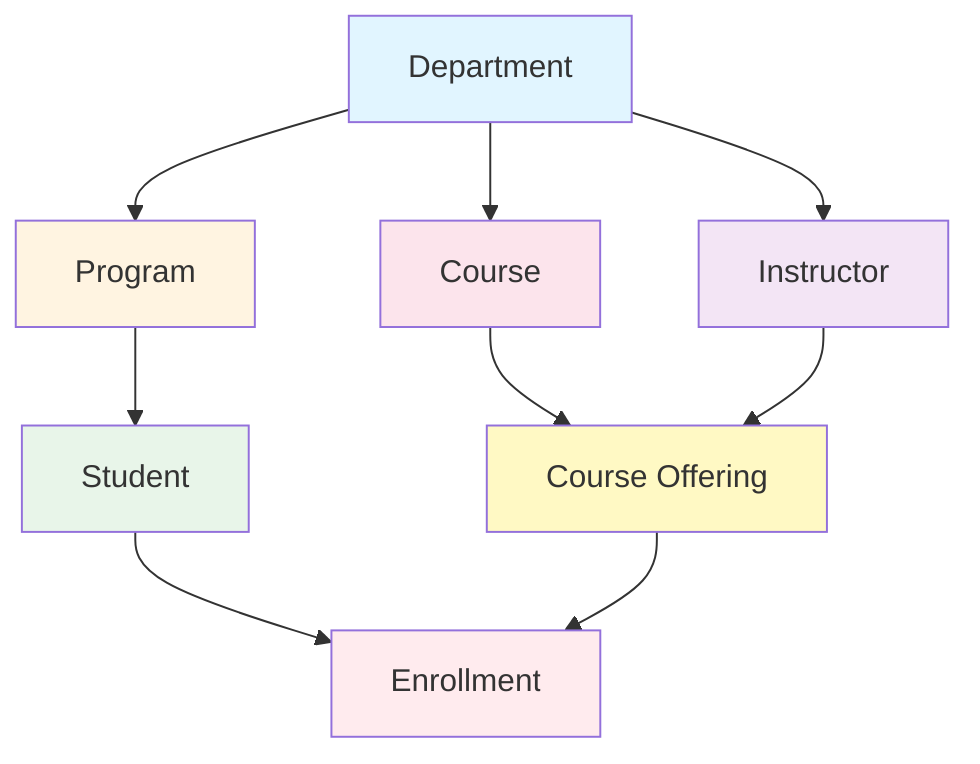
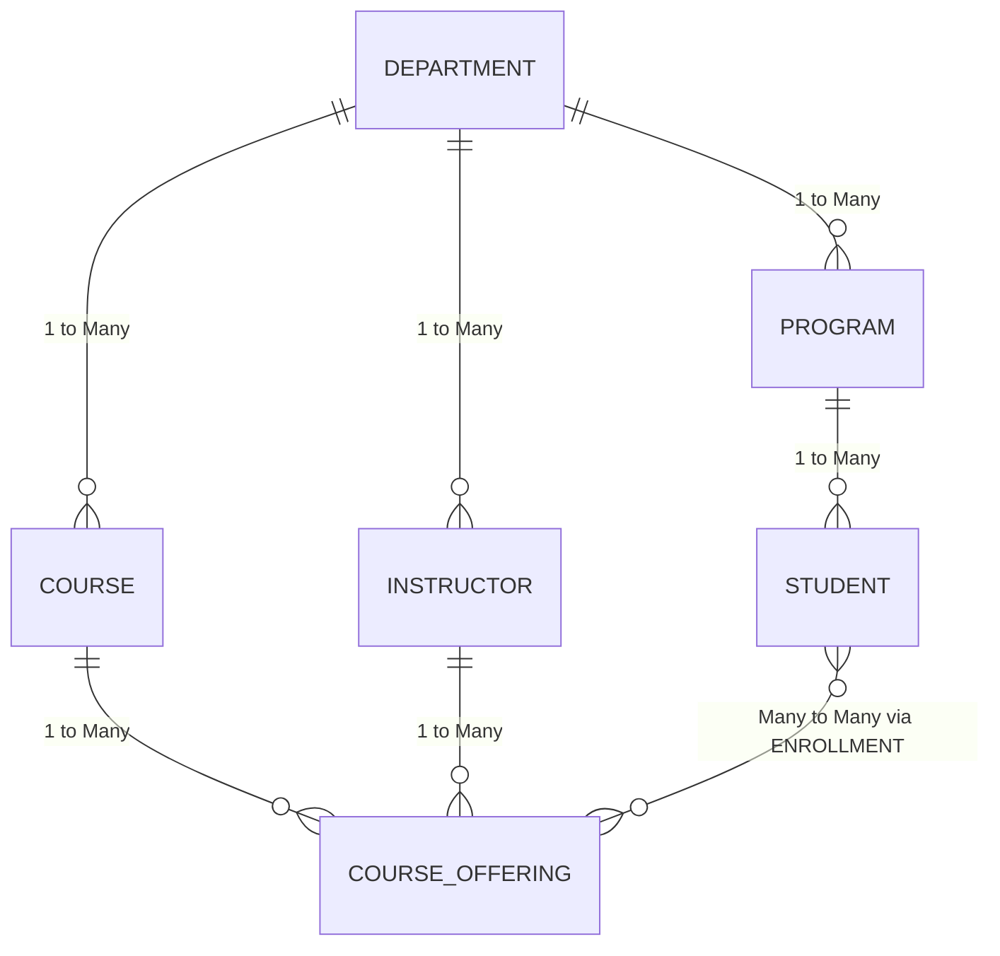

# Entity-Relationship Diagrams

This document contains ER diagrams for the University Course Management System using Mermaid notation.

## Complete ER Diagram

## Simplified Relationship Diagram

## Cardinality Relationships

## Database Schema Relationships

### One-to-Many Relationships

1. **Department → Program**
   - One department offers many programs
   - Each program belongs to one department

2. **Department → Course**
   - One department provides many courses
   - Each course belongs to one department

3. **Department → Instructor**
   - One department employs many instructors
   - Each instructor works in one department

4. **Program → Student**
   - One program enrolls many students
   - Each student is enrolled in one program

5. **Course → CourseOffering**
   - One course has many offerings (different semesters/years)
   - Each offering is an instance of one course

6. **Instructor → CourseOffering**
   - One instructor teaches many course offerings
   - Each offering is taught by one instructor

### Many-to-Many Relationships

1. **Student ↔ CourseOffering** (via Enrollment)
   - A student can enroll in many course offerings
   - A course offering can have many students
   - Resolved through the Enrollment junction table

## Normalization Verification

### First Normal Form (1NF)
✓ All attributes contain atomic values
✓ No repeating groups
✓ Each table has a primary key

### Second Normal Form (2NF)
✓ Satisfies 1NF
✓ No partial dependencies (all non-key attributes fully dependent on primary key)
✓ Example: Student name depends on StudentID, not on part of a composite key

### Third Normal Form (3NF)
✓ Satisfies 2NF
✓ No transitive dependencies
✓ Example: ProgramName is in Program table, not Student table

### Boyce-Codd Normal Form (BCNF)
✓ Satisfies 3NF
✓ Every determinant is a candidate key
✓ No anomalies from functional dependencies

## Referential Integrity

All foreign key relationships enforce referential integrity:

- **ON DELETE RESTRICT**: Prevents deletion of referenced records (e.g., cannot delete a Department if it has Programs)
- **ON UPDATE CASCADE**: Automatically updates foreign keys when primary key changes
- **Triggers**: Maintain CurrentEnrollment count automatically

## Indexes for Performance

Primary indexes (automatic):
- All primary keys

Secondary indexes (explicit):
- Email fields (Student, Instructor)
- Department foreign keys
- Course codes
- Semester/Year combinations
- Enrollment lookups

Composite indexes:
- (CourseID, Semester, Year) for course offering queries
- (StudentID, Status) for enrollment queries
